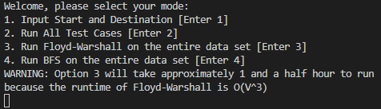
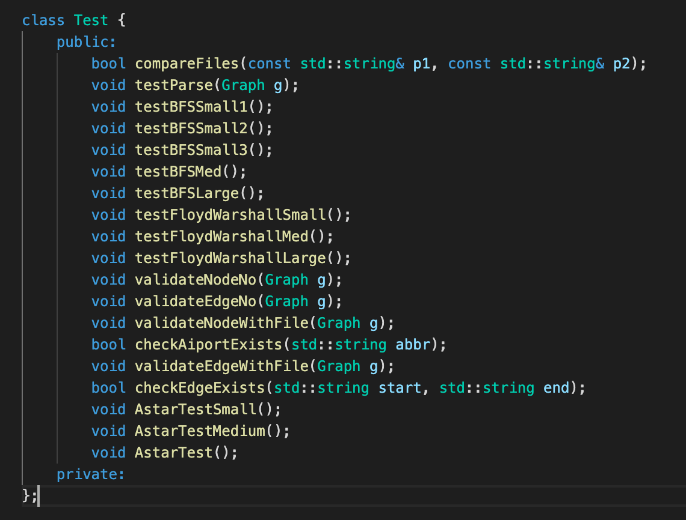

# Final Project
- Team member netIDs: hanxu8-jinyuxu2-dl35-zx32
- Team name: thank you carl


# Github Organization
### Presentation video
- Link: https://youtu.be/Kb15ef3ynfk
### Github file structure

```
├── Feedback/ (Feedback given by mentor)
├── img/ (images used in the written report)
├── tests/ (tests folder containing test cases + test files)
├── data/ (data folder containing all input airport/route data)
├── Contract.md (Team Contract)
├── Proposal.md (initial project proposal)
├── README.md (readme for file organization + running instruction)
├── log.md (weekly development log)
├── results.md (written report)
├── code/ ***.cpp or ***.h (code)
```
# Running instruction
### Build and run our executable

Git clone the project with:

```bash
git clone https://github-dev.cs.illinois.edu/cs225-sp22/hanxu8-jinyuxu2-dl35-zx32.git
```

Go to `code` folder in the project
```bash
cd code
```

Inside `code` folder, do:
```bash
make
```
Run the main program with:
```bash
./main
```
It will pop up with 4 options. 




Enter 1 to run A* algorithm to compute for the shortest distance path between 2 arbitrary airports (goal 1); enter 2 to run all test cases; enter 3 to run Floyd-Warshall on the enter dataset (goal 2); enter 4 to run BFS to compute for the shortest unweighted path between 2 arbitrary airports on the entire data set


Note: 
1. For option 1 and option 4, our program only accepts the [IATA code](https://en.wikipedia.org/wiki/IATA_airport_code) of the airports
2. Since our input dataset is huge; option 3 takes ~ 1.5 hour to run on EWS
3. The input airport for each method is taken through the terminal; the output is shown via the terminal after the user execute the algorithm


### Build and run our test suite

The same step as above.

Git clone the project with:

```bash
git clone https://github-dev.cs.illinois.edu/cs225-sp22/hanxu8-jinyuxu2-dl35-zx32.git
```

Go to `code` folder in the project

```bash
cd code
```

Inside `code` folder, do:

```bash
make
```

Run the main program with:

```bash
./main
```

It will pop up with 4 options. 


Enter 2 to run all test cases. There are 18 comprehensive test cases as shown below. The description is below:

- We take the graph and check whether the parsed values are valid, and whether the graph corresponds to the input dataset. 
- We wrote small / medium / large test cases for our BFS, A*, and FloydWarshall algorithm (the large test case uses the complete dataset, and the small and medium cases use subsets of the dataset).




