# Final Project

## 1. Output and correctness of each algorithm

**Test case results:**

Run "./main" and then choose option 2 "Run All Test Cases". The interactive terminal will execute all test cases. The figure below shows that all test cases passed. There are 18 comprehensive test cases:

- We take the graph and check whether the parsed values are valid, and whether the graph corresponds to the input dataset. 
- We wrote small / medium / large test cases for our BFS, A*, and FloydWarshall algorithm (the large test case uses the complete dataset, and the small and medium cases use subsets of the dataset).

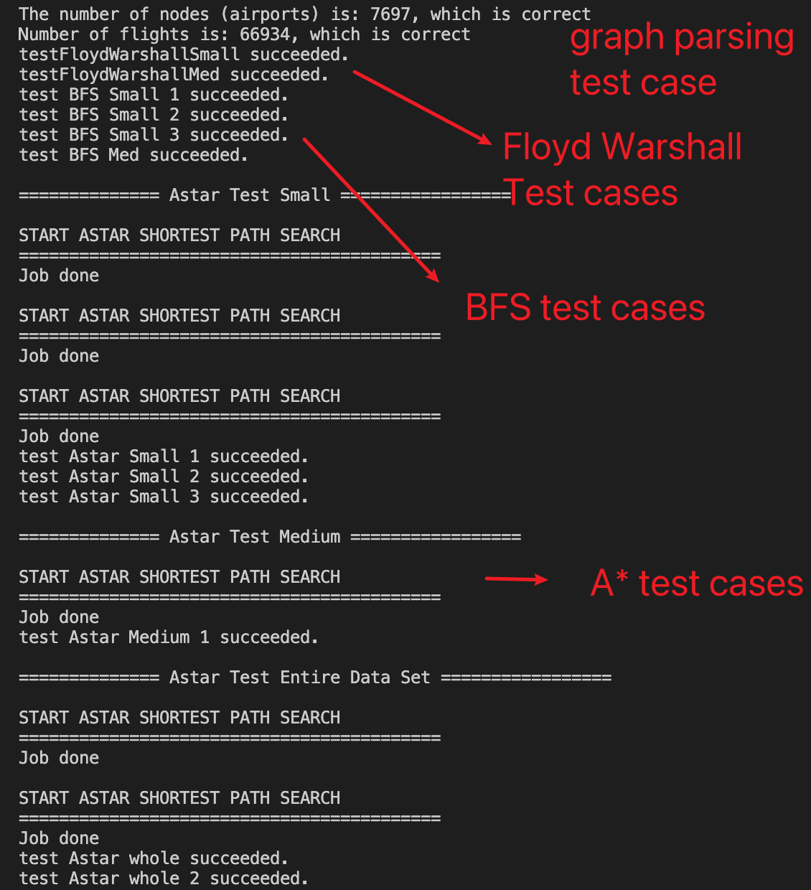  
<b>Figure 1</b>

**BFS output:**

 
<b>Figure 2</b>

Figure 2 shows a standard BFS output. The left is the start airport and the right is the destination airport. The itinerary goes from left to right. We can pass in a boolean parameter "writeToFile" to let the BFS function decide whether BFS outputs the result to the terminal or write to a file.

**BFS correctness:**

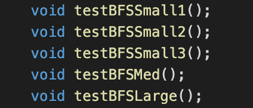 
<b>Figure 3</b>

We have verified the correctness of BFS via 6 test cases. (testBFSSmall1, testBFSSmall2, testBFSSmall3, testBFSMed, testBFSLarge)

The small and medium test cases run on a subset of the complete dataset. The large test cases runs on the complete dataset. All of the test cases passed as shown in Figure 1.

**A\* algorithm output:**

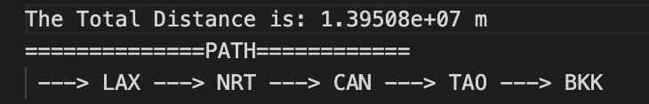 
<b>Figure 4</b>

The above figure shows a standard A\* output. The left is the start airport and the right is the destination airport. The itinerary goes from left to right. We can use either printDetailToFile(std::string fileName) or printDetail() let the A\* function write the result to the file or print the result to the terminal.

**A\* algorithm correctness:**

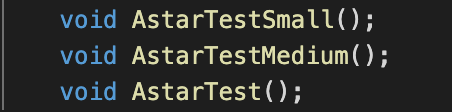 
<b>Figure 5</b>

We have verified the correctness of A\* algorithm via 3 test cases. (AstarTestSmall, AstarTestMedium, AstarTest)

The small and medium test cases run on a subset of the complete dataset. The large test cases runs on the complete dataset. All of the test cases passed as shown in Figure 1.

**Floyd Warshall output:**

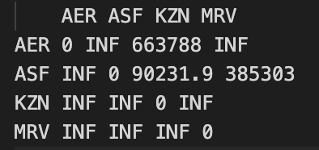 
<b>Figure 6</b>

The above figure shows a standard Floyd Warshall output. It is a matrix with each cell marking the shortest distance between a start point and a destination point. The diagonal are all 0's because the diagonal means there is no distance betwen an airport to itself. The leftmost column marks all start airports and the topmost row marks all destination airports.

**Floyd Warshall correctness:**

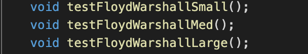 
<b>Figure 7</b>

We have verified the correctness of Floyd Warshall via 3 test cases. (testFloydWarshallSmall, testFloydWarshallMed, testFloydWarshallLarge)

The small and medium test cases run on a subset of 	 the complete dataset. The large test cases runs on the complete dataset. All of the test cases passed as shown in Figure 1.

## 2.  Answer to the leading question

**Leading question 1:**
We want to find the shortest path between any two arbitrary airports. We will use A\* algorithm to solve the problem. 

**Answer to leading question 1:**
Using A\* algorithm, we were able to successfully derive the shortest path between any two arbitrary airports in the data set. Here are 7 shortest path examples:

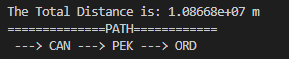 
<b>Figure 9</b>

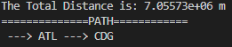 
<b>Figure 10</b>

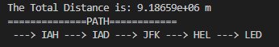 
<b>Figure 11</b>

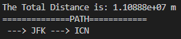 
<b>Figure 12</b>

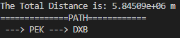 
<b>Figure 13</b>

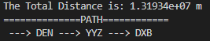 
<b>Figure 14</b>

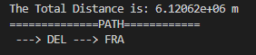 
<b>Figure 15</b>

**Discoveries:**

We discovered that the heuristic we choose for computing the estimated cost will affect the efficiency and effectiveness of A\* algorithm. Here is a [reference](http://theory.stanford.edu/~amitp/GameProgramming/Heuristics.html) on the choices of the heuristic. 

**Leading question 2:**
We want to produce shortest paths between all pairs of airports in our graph.

**Answer to leading question 2:**
We used Floyd Warshall to produce shortest paths between all pairs of airports in our graph. The Floyd Warshall algorithm has successfully output the shortest paths between all pairs of airports. Part of the results is shown in Figure 10.

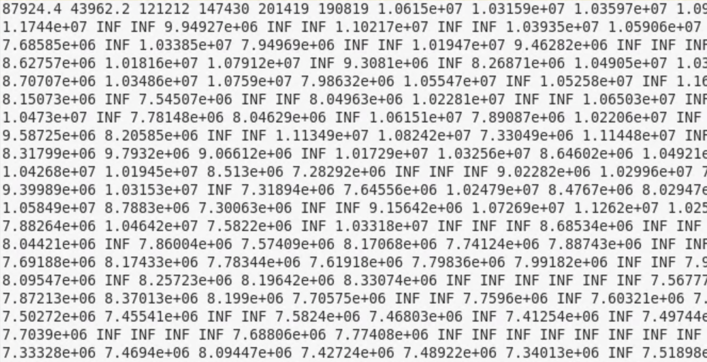 
<b>Figure 16</b>

**Discoveries:**

1. The big O is O(|V|3). This has been reflected by the total run time of the overall program. We used EWS to benchmark our run time of Floyd Warshall algorithm over the entire dataset (). It takes 69 minutes to finish the entire scan.
2. To further improve the run time of Floyd Warshall. We could utilize parallel programming techniques like SIMD. References could be found [here](https://github.com/Wenox/fast-fw).
3. To further make our output more readable, we can output it as a csv file and open it with an Excel application. However, for testing purposes, we output the result in a raw manner.